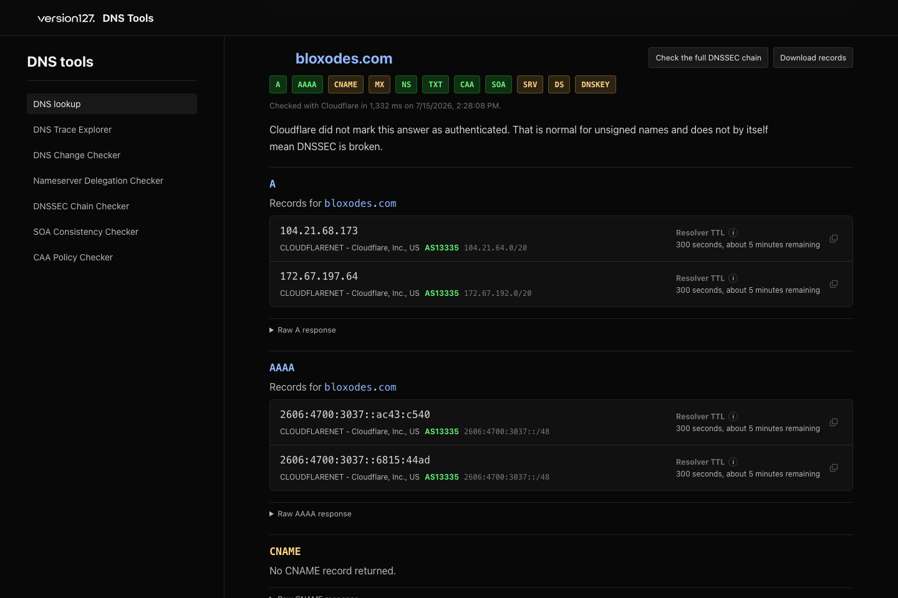

# DNS Tools

DNS Tools is a self-hostable collection for seeing what a domain is actually doing in DNS. It can look up records, follow the path from the root servers, compare a recent change, and inspect delegation, DNSSEC, SOA, and CAA configuration without turning the result into a vague health score.

[Try the hosted tools](https://version127.com/dns-tools) · [API reference](docs/api.md) · [Self-hosting guide](docs/self-hosting.md) · [Tool documentation](docs/tools) · [Launch checklist](docs/launch-checklist.md) · [Changelog](CHANGELOG.md)



## Included tools

| Tool | What it helps you answer |
| --- | --- |
| DNS Lookup | What records does a public resolver or the authoritative nameserver return now? |
| DNS Trace Explorer | Where does the path from the DNS root stop or change direction? |
| DNS Change Checker | Do the authoritative servers and public resolver caches return the same value? |
| Nameserver Delegation Checker | Does the parent point to the right nameservers, and can every server answer over UDP and TCP? |
| DNSSEC Chain Checker | Can one DNS answer be validated cryptographically from the root trust anchor? |
| SOA Consistency Checker | Do the authoritative servers agree on the SOA serial and timing values? |
| CAA Policy Checker | Which certificate authorities may issue normal and wildcard certificates for this name? |

## Quick start with Docker

The host needs outbound HTTPS and direct DNS access over UDP and TCP port 53.

```bash
git clone https://github.com/version127/dns-tools.git
cd dns-tools
docker compose up --build
```

Open `http://localhost:1273`.

## Run with Node

Node.js 24 or newer is recommended.

```bash
npm install
npm run dev
```

The application runs on port `1273`. It does not need a database, user account, or API key.

## Network requirements

Public resolver lookups and DNSSEC validation use DNS-over-HTTPS on TCP port 443. Trace, authoritative lookup, delegation, SOA, and change checks also contact authoritative nameservers directly over UDP port 53 and retry over TCP port 53 when needed. IPv6 nameserver checks need working IPv6 connectivity on the host. When IPv6 is unavailable, those checks are kept visible as skipped instead of being reported as failures of the domain.

Static hosting and Edge-only runtimes cannot run the complete application. A normal Node server, VM, or Docker host is recommended. Some managed platforms block outbound port 53 even when ordinary web requests work.

## Configuration

Copy `.env.example` to `.env.local` when you need to change a default.

| Variable | Default | What it changes |
| --- | --- | --- |
| `NEXT_PUBLIC_SITE_URL` | `http://localhost:1273` | Public base URL used for canonical URLs and the sitemap. |
| `DNS_TOOLS_ALLOW_INDEXING` | `false` | Allows search indexing and sitemap entries when set to `true`. |

Self-hosted copies default to `noindex` so a public test installation does not accidentally duplicate the hosted Version127 pages. Lookup URLs containing a submitted name remain `noindex`.

## How a check works

The browser sends a small request to the matching API route in this application. The Node server validates the name and options, applies a weighted rate limit, performs bounded DNS queries, normalizes the response, and sends the evidence back to the page. Results use `Cache-Control: no-store` and are not written to a database.

Public resolver endpoints are fixed in the server code. A visitor cannot supply an arbitrary upstream URL. Direct DNS checks reject loopback, private, link-local, documentation, multicast, reserved, and other non-public target addresses.

## API

All seven pages use same-origin JSON APIs under `/api/dns`. The API accepts direct command-line requests, but cross-origin browser requests are rejected by default.

See [docs/api.md](docs/api.md) for request examples, errors, rate limits, and response fields. The machine-readable contract is available in [openapi.yaml](openapi.yaml).

## Privacy

The name being checked is sent to the resolver selected by the visitor or to the authoritative nameservers involved in the check. ASN enrichment uses Team Cymru data through DNS. When a website-style name is submitted, the visitor's browser may request that site's `/favicon.ico` directly. The application does not store lookup history or require analytics.

A self-hoster still controls their Node, Docker, and reverse-proxy logs. Those logs should be configured separately if queried names must not be retained.

## Security and limits

The server bounds request bodies, DNS response sizes, time, aliases, referrals, nested nameserver resolution, and total query count. Direct targets must be public IP addresses. DNS response IDs must match the request. The built-in rate limiter is intentionally simple and lives in one Node process.

Public installations should run behind a reverse proxy that overwrites forwarded client-IP headers and provides an additional request limit. Read [SECURITY.md](SECURITY.md) and [docs/security.md](docs/security.md) before exposing the service to the internet.

## Development

```bash
npm run typecheck
npm run test:unit
npm run test:e2e
npm run build
npm run quality
```

The core DNS engine lives in `lib/dns`, the seven server routes live in `app/api/dns`, and the corresponding pages live in `app/(site)`. Each tool has matching documentation under `docs/tools/<tool>/` and page tests under `tests/pages/<tool>/`. Shared transport and repository checks stay under `tests/shared/`.

Read [docs/architecture.md](docs/architecture.md) before changing transport or normalization behavior. Maintainers should also read [how this repository stays synchronized with Version127](docs/maintainers/syncing-with-version127.md).

## License and attribution

DNS Tools is available under the [MIT License](LICENSE). It uses `dns-packet`, Namefi DNSSEC Audit, Lucide, Next.js, React, reviewed IANA root-server addresses, public DNS resolver services, and Team Cymru DNS data. Resolver and network services keep their own terms and privacy policies.

Built by [Version127](https://version127.com).
